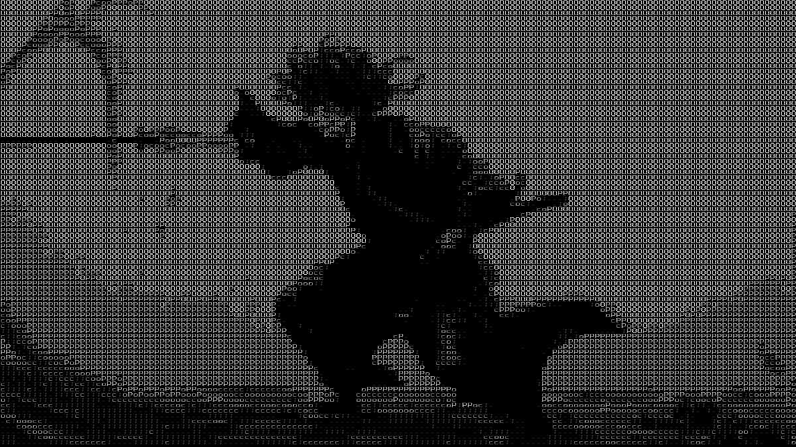

# Gibberish

Turn any image (_and soon video_) into ascii art.



## About

Inspirations, people involved, TODOs

## Environment setup

```sh
sudo choco install llvm
scoop install pkg-config vcpkg msys2
vcpkg install ffmpeg

$env:PKG_CONFIG_PATH = "~/persist/vcpkg/installed/x64-windows/lib/pkgconfig"
$env:OUT_DIR = "./ffmpeg-sys-next-out"

LIBCLANG_PATH = "C:\\Program Files\\LLVM\\lib"
FFMPEG_DIR = "C:\\Users\\T14\\scoop\\apps\\vcpkg\\current\\packages\\ffmpeg_x64-windows"
PKG_CONFIG_PATH = "C:\\Users\\T14\\scoop\\persist\\vcpkg\\installed\\x64-windows\\lib\\pkgconfig"

```

## Installation

> TODO: How to install binaries or compile.

## How to use

```sh
cargo run -- path/to/image --img
```