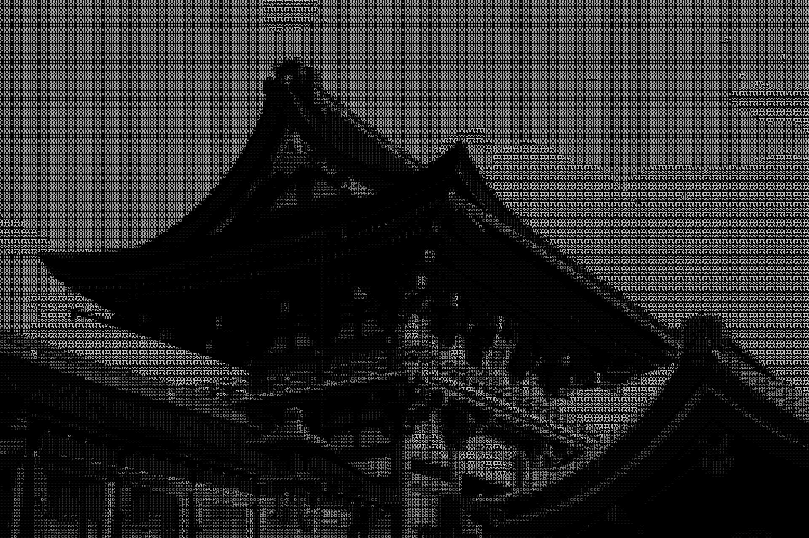

# Ascii

Turn any image (_and soon video_) into ascii art.


[_Go to galery_](#galery)

## About

This project is inspired by a video from the graphics programmer and content creator [Acerola](https://www.youtube.com/@Acerola_t), who made a [video on ascii art](https://youtu.be/gg40RWiaHRY?si=-8QZkvO8Thm2zgVa).

<!-- ## Environment setup

Check out [https://scoop.sh](https://scoop.sh) for help installing `scoop`.

```sh
scoop install 7zip

$VCINSTALLDIR = $(& "${env:ProgramFiles(x86)}\Microsoft Visual Studio\Installer\vswhere.exe" -latest -property installationPath)
Add-Content $env:GITHUB_ENV "LIBCLANG_PATH=${VCINSTALLDIR}\VC\Tools\LLVM\x64\bin`n"
Invoke-WebRequest "${env:FFMPEG_DOWNLOAD_URL}" -OutFile ffmpeg-release-full-shared.7z
7z x ffmpeg-release-full-shared.7z
mkdir ffmpeg
mv ffmpeg-*/* ffmpeg/
Add-Content $env:GITHUB_ENV "FFMPEG_DIR=${pwd}\ffmpeg`n"
Add-Content $env:GITHUB_PATH "${pwd}\ffmpeg\bin`n"
``` -->

## Installation

```sh
cargo install --git https://github.com/JorgeTerence/ascii
```

Or download the executable from the latest release.

## How to use

```sh
ascii path/to/media
```

### Options

- `-d` or `--display`: Automatically open the output in the system's default media viewer;
- `-i` or `--invert`: Invert the input media's luminance values;
- `-o` or `--output`: Set output format; accepts _img_, _txt_ or _video_ (not yet implemented)

## Future plans

- [ ] Edge detection
- [ ] Support for video formats
- [ ] Live video from camera stream

## Galery



Photo by Kai-Chieh Chan: [https://www.pexels.com/photo/red-and-brown-temple-569893](https://www.pexels.com/photo/red-and-brown-temple-569893)


